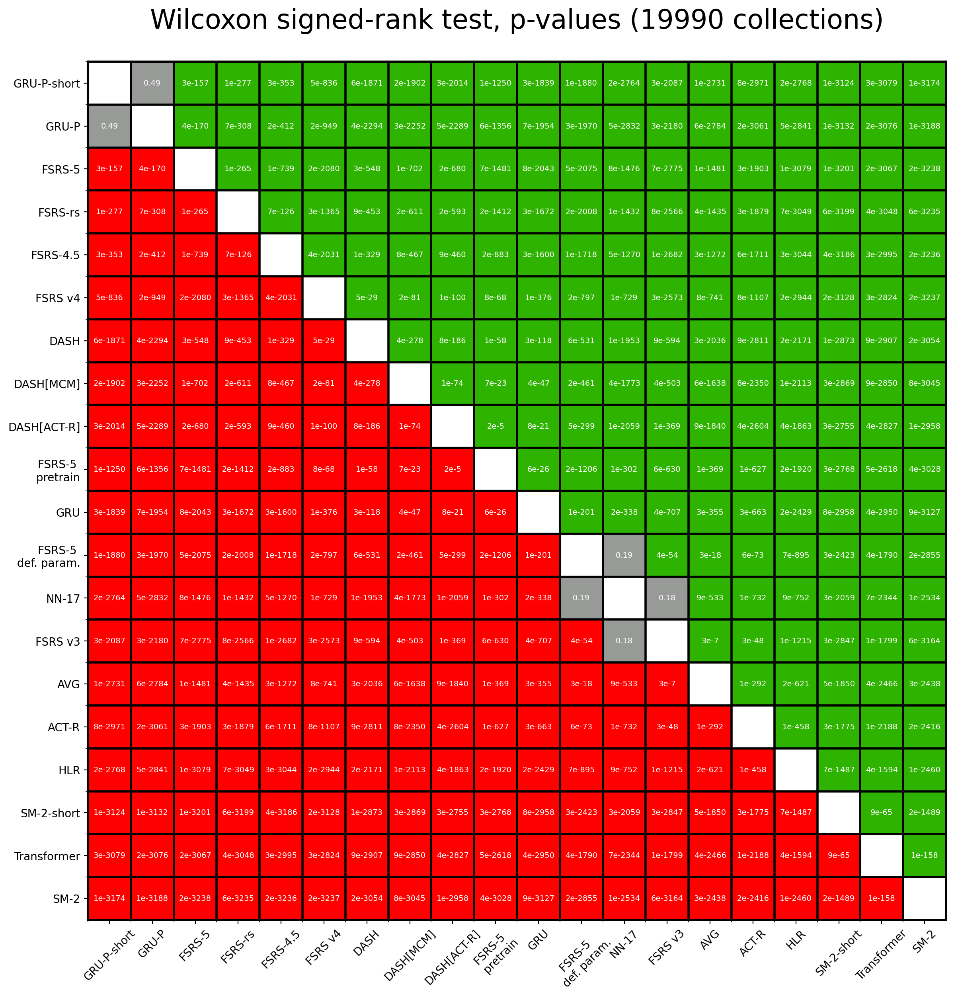

# FSRS Benchmark

## Introduction

Spaced repetition algorithms are computer programs designed to help people schedule reviews of flashcards. A good spaced repetition algorithm helps you remember things more efficiently. Instead of cramming all at once, it spreads out your study sessions over time. To make this efficient, these algorithms try to understand how your memory works. They aim to predict when you're likely to forget something, so they can schedule a review just in time.

This benchmark is a tool to test how well different algorithms do at predicting your memory. It compares several algorithms to see which ones give the most accurate predictions.

## Dataset

The dataset for the FSRS benchmark comes from 20 thousand people who use Anki, a flashcard app. In total, this dataset contains information about ~1.5 billion reviews of flashcards. If you would like to obtain the full dataset, please contact [Damien Elmes](https://github.com/dae), the main Anki developer.

## Evaluation

### Data Split

In the FSRS benchmark, we use a tool called `TimeSeriesSplit`. This is part of the [sklearn](https://scikit-learn.org/) library used for machine learning. The tool helps us split the data by time: older reviews are used for training and newer reviews for testing. That way, we don't accidentally cheat by giving the algorithm future information it shouldn't have. In practice, we use past study sessions to predict future ones. This makes `TimeSeriesSplit` a good fit for our benchmark.

Note: TimeSeriesSplit will remove the first split from evaluation. This is because the first split is used for training, and we don't want to evaluate the algorithm on the same data it was trained on.

### Metrics

We use two metrics in the FSRS benchmark to evaluate how well these algorithms work: log loss and a custom RMSE that we call RMSE (bins).

- Log Loss (also known as Binary Cross Entropy): Utilized primarily for its applicability in binary classification problems, log loss serves as a measure of the discrepancies between predicted probabilities of recall and review outcomes (1 or 0). It quantifies how well the algorithm approximates the true recall probabilities, making it an important metric for model evaluation in spaced repetition systems.
- Weighted Root Mean Square Error in Bins (RMSE (bins)): This is a metric engineered for the FSRS benchmark. In this approach, predictions and review outcomes are grouped into bins according to the predicted probabilities of recall. Within each bin, the squared difference between the average predicted probability of recall and the average recall rate is calculated. These values are then weighted according to the sample size in each bin, and then the final weighted root mean square error is calculated. This metric provides a nuanced understanding of model performance across different probability ranges.

Smaller is better. If you are unsure what metric to look at, look at RMSE (bins). That value can be interpreted as "the average difference between the predicted probability of recalling a card and the measured probability". For example, if RMSE (bins)=0.05, it means that that algorithm is, on average, wrong by 5% when predicting the probability of recall.

### Models

- FSRS v3: the first version of the FSRS algorithm that people actually used.
- FSRS v4: the upgraded version of FSRS, made better with help from the community.
- FSRS-4.5: the minorly improved version based on FSRS v4. The shape of the forgetting curve has been changed. This benchmark also includes FSRS-4.5 with default parameters (which have been obtained by running FSRS-4.5 on all 20 thousand collections) and FSRS-4.5 where only the first 4 parameters (values of initial stability after the first review) are optimized and the rest are set to default.
- FSRS rs: the Rust port of FSRS v4, it's simplified due to the limitations of the Rust-based deep learning framework. See also: https://github.com/open-spaced-repetition/fsrs-rs
- LSTM: a type of neural network that's often used for making predictions based on a sequence of data. It's a classic in the field of machine learning for time-related tasks.
- Transformer: a type of neural network that has gained popularity in recent years due to its superior performance in natural language processing. ChatGPT is based on this architecture.
- DASH: the model proposed in [here](https://doi.org/10.4324/9781315413570-8). The name stands for Difficulty, Ability, and Study History. In our benchmark, we only use the Ability and Study History because the Difficulty part is not applicable to our dataset. We also added two other variants of this model: DASH[MCM] and DASH[ACT-R]. For more details, you can read the paper [here](https://www.politesi.polimi.it/retrieve/b39227dd-0963-40f2-a44b-624f205cb224/2022_4_Randazzo_01.pdf).
- ACT-R: the model proposed in [here](http://act-r.psy.cmu.edu/wordpress/wp-content/themes/ACT-R/workshops/2003/proceedings/46.pdf). It includes an activation-based system of declarative memory. It explains the spacing effect by the activation of memory traces.
- HLR: the model proposed by Duolingo. Its full name is Half-Life Regression. For more details, you can read the paper [here](https://github.com/duolingo/halflife-regression).
- SM-2: one of the early algorithms used by SuperMemo, the first spaced repetition software. It was developed more than 30 years ago, and it's still popular today. [Anki's default algorithm is based on SM-2](https://faqs.ankiweb.net/what-spaced-repetition-algorithm.html), [Mnemosyne](https://mnemosyne-proj.org/principles.php) also uses it.

For more details about the FSRS algorithm, read this wiki page: [The Algorithm](https://github.com/open-spaced-repetition/fsrs4anki/wiki/The-Algorithm).

## Result

Total number of users: 19,990.

Total number of reviews for evaluation: 708,151,820. Same-day reviews are excluded; only one review per day (the first chronologically) is used by each algorithm. This is why the number of reviews is significantly lower than the 1.5 billion mentioned earlier. Plus, an outlier filter is also used.

The following tables represent the weighted means and the 99% confidence intervals. The best result is highlighted in **bold**. The rightmost column shows the number of optimizable (trainable) parameters. If a parameter is a constant, it is not included.

### Weighted by number of reviews

| Algorithm | Log Loss | RMSE (bins) | Parameters |
| --- | --- | --- | --- |
| FSRS-4.5 | **0.32±0.006** | 0.043±0.0010 | 17 |
| DASH | 0.33±0.005 | **0.038±0.0008** | 9 |
| DASH[MCM] | 0.33±0.005 | 0.039±0.0008 | 9 |
| DASH[ACT-R] | 0.33±0.005 | 0.039±0.0011 | 5 |
| FSRS rs | 0.33±0.006 | 0.046±0.0011 | 17 |
| FSRS v4 | 0.33±0.006 | 0.052±0.0014 | 17 |
| FSRS-4.5 (only pretrain) | 0.34±0.006 | 0.065±0.0018 | 4 |
| ACT-R | 0.35±0.006 | 0.043±0.0013 | 5 |
| FSRS-4.5 (default parameters) | 0.35±0.006 | 0.076±0.0020 | 0 |
| FSRS v3 | 0.36±0.007 | 0.068±0.0016 | 13 |
| LSTM | 0.37±0.007 | 0.075±0.0017 | 489 |
| SM-2 | 0.54±0.012 | 0.170±0.0031 | 0 |
| Transformer | 0.56±0.018 | 0.182±0.0045 | 622 |
| HLR | 0.70±0.017 | 0.193±0.0046 | 3 |

### Weighted by ln(number of reviews)

| Algorithm | Log Loss | RMSE (bins) | Parameters |
| --- | --- | --- | --- |
| FSRS-4.5 | **0.346±0.0030** | 0.063±0.0008 | 17 |
| DASH | 0.350±0.0030 | **0.052±0.0007** | 9 |
| FSRS rs | 0.350±0.0031 | 0.066±0.0008 | 17 |
| DASH[MCM] | 0.351±0.0031 | 0.055±0.0007 | 9 |
| DASH[ACT-R] | 0.354±0.0032 | 0.055±0.0009 | 5 |
| FSRS v4 | 0.354±0.0033 | 0.074±0.0009 | 17 |
| FSRS-4.5 (only pretrain) | 0.361±0.0032 | 0.079±0.0009 | 4 |
| FSRS-4.5 (default parameters) | 0.376±0.0033 | 0.095±0.0011 | 0 |
| ACT-R | 0.382±0.0035 | 0.064±0.0010 | 5 |
| FSRS v3 | 0.416±0.0043 | 0.104±0.0014 | 13 |
| LSTM | 0.50±0.007 | 0.137±0.0018 | 489 |
| Transformer | 0.56±0.008 | 0.181±0.0018 | 622 |
| SM-2 | 0.68±0.011 | 0.210±0.0020 | 0 |
| HLR | 2.03±0.045 | 0.391±0.0040 | 3 |

Averages weighted by the number of reviews are more representative of "best case" performance when plenty of data is available. Since all algorithms perform better when there's a lot of data to learn from, weighting by n(reviews) biases the average towards lower values.
Averages weighted by the natural logarithm of the number of reviews are more representative of "average case" performance. In reality, not every user will have hundreds of thousands of reviews, so the algorithm won't always be able to reach its full potential.

The image below shows the p-values obtained by running the Wilcoxon signed-rank test on the log loss of all pairs of algorithms. Red means that the row algorithm performs worse than the corresponding column algorithm, and green means that the row algorithm performs better than the corresponding column algorithm. The top row is green because FSRS-4.5 outperforms all other algorithms; the bottom row is red because HLR performs worse than any other algorithm. Grey means that the p-value is >0.05, and we cannot conclude that one algorithm performs better than the other.

Almost all p-values are extremely small, many orders of magnitude smaller than 0.05. Of course, p-values this low beg the question, "Can we even trust these values?". `scipy.stats.wilcoxon` itself uses an approximation for n>50, and our modified implementation uses an approximation to return the log10(p-value) rather than the p-value itself, to avoid the limitations of 64-bit floating point numbers. So it's an approximation of an approximation. But more importantly, this test is not weighted, meaning that it doesn't take into account the fact that log loss depends on the number of reviews.
Overall, these p-values can be trusted on a qualitative (but not quantitative) level.



## Median Parameters

FSRS-4.5:

```
0.5701, 1.4436, 4.1386, 10.9355,
5.1377, 1.225, 0.8735, 0.0375,
1.647, 0.1361, 1.0293,
2.1111, 0.0864, 0.323, 1.4188,
0.219, 2.8467
```

FSRS rs:

```
0.5612, 1.4166, 4.1698, 11.2266,
5.1274, 1.1907, 0.8412, 0.0654,
1.6634, 0.147, 1.0075,
2.1539, 0.0764, 0.3215, 1.4171,
0.2403, 2.9212
```

## Comparisons with SuperMemo 15/16/17

Please go to:
- [fsrs-vs-sm15](https://github.com/open-spaced-repetition/fsrs-vs-sm15)
- [fsrs-vs-sm17](https://github.com/open-spaced-repetition/fsrs-vs-sm17)


## Run the benchmark

### Requirements

Dataset (tiny): https://github.com/open-spaced-repetition/fsrs-benchmark/issues/28#issuecomment-1876196288

Dependencies:

```bash
pip install -r requirements.txt
```

### Commands

FSRS-4.5:

```bash
python script.py
```

FSRS-4.5 with default parameters:

```bash
DRY_RUN=1 python script.py
```

FSRS-rs:

```bash
FSRS_RS=1 FSRS_NO_OUTLIER=1 PYTHONPATH=~/Codes/anki/out/pylib:~/Codes/anki/pylib python script.py
```

> Please change the `PYTHONPATH` variable to the path of your Anki source code.

FSRSv4/FSRSv3/HLR/LSTM/SM2:

```bash
MODEL=FSRSv4 python other.py
```

> Please change the `MODEL` variable to `FSRSv3`, `HLR`, `LSTM`, or `SM2` to run the corresponding model.

Dev model in fsrs-optimizer:

```bash
DEV_MODE=1 python script.py
```

> Please place the fsrs-optimizer repository in the same directory as this repository.
