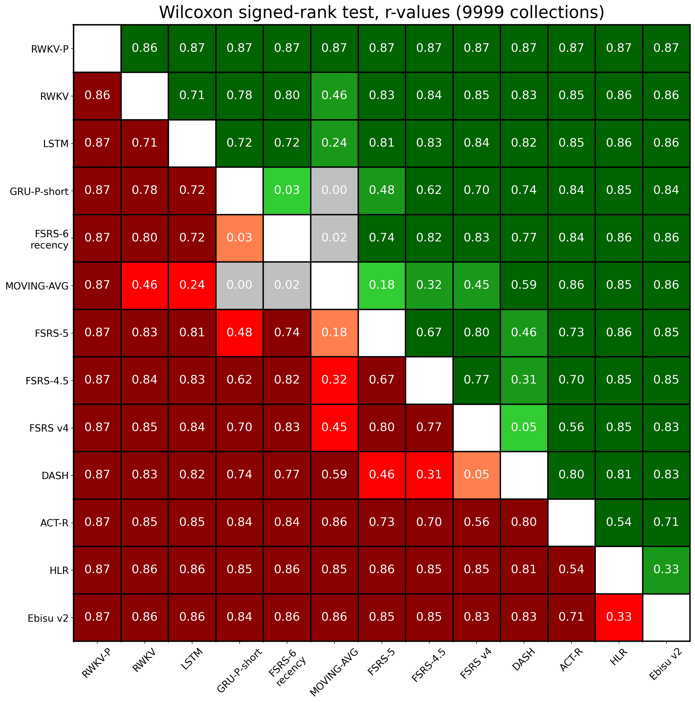

# SRS Benchmark

## Introduction

Spaced repetition algorithms are computer programs designed to help people schedule reviews of flashcards. A good spaced repetition algorithm helps you remember things more efficiently. Instead of cramming all at once, it distributes your reviews over time. To make this efficient, these algorithms try to understand how your memory works. They aim to predict when you're likely to forget something, so they can schedule a review accordingly.

This benchmark is designed to assess the predictive accuracy of various algorithms. A multitude of algorithms are evaluated to find out which ones provide the most accurate predictions.

**We will evaluate your algorithm! [Open a GitHub issue](https://github.com/open-spaced-repetition/srs-benchmark/issues/new) or contact [L-M-Sherlock](https://github.com/L-M-Sherlock).**

## Dataset

~~The dataset for the SRS benchmark comes from 20 thousand people who use Anki, a flashcard app. In total, this dataset contains information about \~1.7 billion reviews of flashcards. The full dataset is hosted on Hugging Face Datasets: [open-spaced-repetition/FSRS-Anki-20k](https://huggingface.co/datasets/open-spaced-repetition/FSRS-Anki-20k).~~

The dataset for the SRS benchmark comes from 10 thousand users who use Anki, a flashcard app. In total, this dataset contains information about ~727 million reviews of flashcards. The full dataset is hosted on Hugging Face Datasets: [open-spaced-repetition/anki-revlogs-10k](https://huggingface.co/datasets/open-spaced-repetition/anki-revlogs-10k).

## Evaluation

### Data Split

In the SRS benchmark, we use a tool called `TimeSeriesSplit`. This is part of the [sklearn](https://scikit-learn.org/) library used for machine learning. The tool helps us split the data by time: older reviews are used for training and newer reviews for testing. That way, we don't accidentally cheat by giving the algorithm future information it shouldn't have. In practice, we use past study sessions to predict future ones. This makes `TimeSeriesSplit` a good fit for our benchmark.

Note: TimeSeriesSplit will remove the first split from evaluation. This is because the first split is used for training, and we don't want to evaluate the algorithm on the same data it was trained on.

RWKV and RMSE-BINS-EXPLOIT do not use TimeSeriesSplit.

### Metrics

We use three metrics in the SRS benchmark to evaluate how well these algorithms work: Log Loss, AUC, and a custom RMSE that we call RMSE (bins).

- Log Loss (also known as Binary Cross Entropy): used primarily in binary classification problems, Log Loss serves as a measure of the discrepancies between predicted probabilities of recall and review outcomes (1 or 0). It quantifies how well the algorithm approximates the true recall probabilities. Log Loss ranges from 0 to infinity, lower is better.
- Root Mean Square Error in Bins (RMSE (bins)): this is a metric designed for use in the SRS benchmark. In this approach, predictions and review outcomes are grouped into bins based on three features: the interval length, the number of reviews, and the number of lapses. Within each bin, the squared difference between the average predicted probability of recall and the average recall rate is calculated. These values are then weighted according to the sample size in each bin, and then the final weighted root mean square error is calculated. This metric provides a nuanced understanding of algorithm performance across different probability ranges. For more details, you can read [The Metric](https://github.com/open-spaced-repetition/fsrs4anki/wiki/The-Metric). RMSE (bins) ranges from 0 to 1, lower is better.
- AUC (Area under the ROC Curve): this metric tells us how much the algorithm is capable of distinguishing between classes. AUC ranges from 0 to 1, however, in practice it's almost always greater than 0.5; higher is better.

Log Loss and RMSE (bins) measure calibration: how well predicted probabilities of recall match the real data. AUC measures discrimination: how well the algorithm can tell two (or more, generally speaking) classes apart. AUC can be good (high) even if Log Loss and RMSE are poor.

### Algorithms and algorithm families

- Two component or three component* model of memory:
    - FSRS v1 and v2: the initial experimental versions of FSRS.
    - FSRS v3: the first official release of the FSRS algorithm, made available as a custom scheduling script.
    - FSRS v4: the upgraded version of FSRS, made better with help from the community.
    - FSRS-4.5: the minorly improved version based on FSRS v4. The shape of the forgetting curve has been changed.
    - FSRS-5: the upgraded version of FSRS. Unlike the previous versions, it uses the same-day review data. Same-day reviews are used only for training, and not for evaluation.
    - FSRS-6: the latest version of FSRS. The formula for handling same-day reviews has been improved. More importantly, FSRS-6 has an optimizable parameter that controls the flatness of the forgetting curve, meaning that the shape of the curve is different for different users.
        - FSRS-6 default param.: FSRS-6 with default parameters. The default parameters have been obtained by running FSRS-6 on all 10 thousand collections from the dataset and calculating the median of each parameter.
        - FSRS-6 pretrain: FSRS-6 where only the first 4 parameters (values of initial stability after the first review) are optimized and the rest are set to default.
        - FSRS-6 binary: FSRS-6 which treats `hard` and `easy` grades as `good`.
        - FSRS-6 preset: different parameters are used for each preset. The minimum number of presets in Anki is one, a preset can be applied to multiple decks.
        - FSRS-6 deck: different parameters are used for each deck.
        - FSRS-6 recency: FSRS-6 trained with reviews being weighted based on their recency, such that older reviews affect the loss function less and newer reviews affect it more.
    - FSRS-rs: the Rust port of FSRS-6. See also: https://github.com/open-spaced-repetition/fsrs-rs
    - HLR: the algorithm proposed by Duolingo. Its full name is Half-Life Regression. For further information, please refer to the [this paper](https://github.com/duolingo/halflife-regression).
    - Ebisu v2: [an algorithm that uses Bayesian statistics](https://fasiha.github.io/ebisu/) to update its estimate of memory half-life after every review.

*In the two-component model of long-term memory, two independent variables are used to describe the status of unitary memory in a human brain: retrievability (R), or retrieval strength/probability of recall; and stability (S), or storage strength/memory half-life. The expanded three-component model adds a third variable - difficulty (D).

- Alternative models of memory:
    - DASH: the algorithm proposed in [this paper](https://scholar.colorado.edu/concern/graduate_thesis_or_dissertations/zp38wc97m). The name stands for Difficulty, Ability, and Study History. In our benchmark, we only use the Ability and Study History because the Difficulty part is not applicable to our dataset. We also added two other variants of this algorithm: DASH[MCM] and DASH[ACT-R]. For further information, please refer to [this paper](https://www.politesi.polimi.it/retrieve/b39227dd-0963-40f2-a44b-624f205cb224/2022_4_Randazzo_01.pdf).
    - ACT-R: the algorithm proposed in [this paper](http://act-r.psy.cmu.edu/wordpress/wp-content/themes/ACT-R/workshops/2003/proceedings/46.pdf). It includes an activation-based system of declarative memory. It explains the spacing effect by the activation of memory traces.

- Neural networks:
    - GRU: a type of recurrent neural network that's often used for making predictions based on a sequence of data. It's a classic in the field of machine learning for time-related tasks. It uses the same power forgetting curve as FSRS-4.5 and FSRS-5 to make the comparison more fair.
        - GRU-P: a variant of GRU that removes the fixed forgetting curve and predicts the probability of recall directly. This makes it more flexible than GRU, but also more prone to making strange predictions, such as the probability of recall *increasing* over time.
    - LSTM: a recurrent neural network with a more complex and sophisticated architecture than GRU. It is trained using the [Reptile algorithm](https://openai.com/index/reptile/). It uses short-term reviews, fractional intervals, and the duration of review as part of its input.
      The three aforementioned neural networks were first pretrained on 100 users and then further optimized on each user individually.
    - RWKV: uses a modified version of the [RWKV](https://github.com/BlinkDL/RWKV-LM) architecture, which combines the properties of an RNN and a Transformer. It has too many input features to list, so here is a *short* version: fractional interval lengths, grades, duration of the review, note ID, deck ID, preset ID, sibling information, hour of the day, day of the week, and number of new and review cards done today.
        - RWKV-P: predicts the result of a review at the time of the review. Does not have a forgetting curve in the traditional sense and predicts the probability of recall directly. Just like GRU-P, it may output unintuitive predictions, for example, it may never predict 100% or predict that the probability of recall will increase over time.
        - RWKV: predicts the result of a review after the previous review of the card by using a forgetting curve.
- SM-2-based algorithms:
    - SM-2: one of the early algorithms used by SuperMemo, the first spaced repetition software. It was developed more than 30 years ago, and it's still popular today. [Anki's default algorithm is based on SM-2](https://faqs.ankiweb.net/what-spaced-repetition-algorithm.html), [Mnemosyne](https://mnemosyne-proj.org/principles.php) also uses it. This algorithm does not predict the probability of recall natively; therefore, for the sake of the benchmark, the output was modified based on some assumptions about the forgetting curve. The algorithm is described by Piotr Wozniak [here](https://super-memory.com/english/ol/sm2.htm).
        - SM-2 trainable: SM-2 algorithm with optimizable parameters.
    - Anki-SM-2: a variant of the SM-2 algorithm that is used in Anki.
        - Anki-SM-2 trainable: Anki algorithm with optimizable parameters.
- Other:
    - AVG: an "algorithm" that outputs a constant equal to the user's average retention. Has no practical applications and is intended only to serve as a baseline.
    - RMSE-BINS-EXPLOIT: an algorithm that exploits the calculation of RMSE (bins) by simulating the bins and keeping the error term close to 0.

For further information regarding the FSRS algorithm, please refer to the following wiki page: [The Algorithm](https://github.com/open-spaced-repetition/fsrs4anki/wiki/The-Algorithm).

## Result

Total number of users: 9,999.

Total number of reviews for evaluation: 349,923,850.
Same-day reviews are not used for evaluation, but some algorithms use them to refine their predictions of probability of recall for the next day. Some reviews are filtered out, for example, the revlog entries created by changing the due date manually or reviewing cards in a filtered deck with "Reschedule cards based on my answers in this deck" disabled. Finally, an outlier filter is applied. These are the reasons why the number of reviews used for evaluation is significantly lower than the figure of 727 million mentioned earlier. 

The following tables present the means and the 99% confidence intervals. The best result is highlighted in **bold**. The "Parameters" column shows the number of optimizable (trainable) parameters. If a parameter is a constant, it is not included. Arrows indicate whether lower (↓) or higher (↑) values are better.

For the sake of brevity, the following abbreviations are used in the "Input features" column:

**IL** = **i**nterval **l**engths, in days

**FIL** = **f**ractional (aka non-integer) **i**nterval **l**engths

**G** = **g**rades (Again/Hard/Good/Easy)

**SR** = **s**ame-day (or **s**hort-term) **r**eviews

**AT** = **a**nswer **t**ime (duration of the review), in milliseconds

### Weighted by the number of reviews

| Algorithm | Parameters | Log Loss↓ | RMSE (bins)↓ | AUC↑ | Input features |
| --- | --- | --- | --- | --- | --- |
| **RWKV-P** | 2762884 | **0.2709±0.0074** | 0.01450±0.00037 | **0.8233±0.0040** | Yes |
| RWKV | 2762884 | 0.2991±0.0075 | 0.0341±0.0012 | 0.7699±0.0032 | Yes |
| LSTM | 8869 | 0.3115±0.0079 | 0.0354±0.0011 | 0.7332±0.0038 | FIL, G, SR, AT |
| GRU-P-short | 297 | 0.3195±0.0080 | 0.0421±0.0013 | 0.7096±0.0047 | IL, G, SR|
| FSRS-6 recency | 21 | 0.3198±0.0080 | 0.0437±0.0013 | 0.7096±0.0041 | IL, G, SR |
| FSRS-rs | 21 | 0.3198±0.0083 | 0.0437±0.0012 | 0.7095±0.0040 | IL, G, SR |
| FSRS-6 | 21 | 0.3215±0.0082 | 0.0464±0.0013 | 0.7060±0.0041 | IL, G, SR |
| FSRS-6 preset | 21 | 0.3217±0.0080 | 0.0457±0.0013 | 0.7073±0.0040 | IL, G, SR |
| GRU-P | 297 | 0.3251±0.0082 | 0.0433±0.0013 | 0.6991±0.0046 | IL, G |
| FSRS-6 binary | 17 | 0.3256±0.0082 | 0.0485±0.0014 | 0.6865±0.0046 | IL, G, SR |
| FSRS-5 | 19 | 0.3273±0.0082 | 0.0518±0.0016 | 0.7025±0.0041 | IL, G, SR |
| FSRS-6 deck | 21 | 0.3289±0.0082 | 0.0521±0.0017 | 0.6986±0.0042 | IL, G, SR |
| FSRS-4.5 | 17 | 0.3324±0.0084 | 0.0536±0.0016 | 0.6918±0.0041 | IL, G |
| FSRS v4 | 17 | 0.3378±0.0086 | 0.0582±0.0017 | 0.6891±0.0043 | IL, G |
| FSRS-6 pretrain | 4 | 0.3385±0.0084 | 0.0698±0.0023 | 0.6951±0.0039 | IL, G, SR |
| DASH-short | 9 | 0.3395±0.0084 | 0.0660±0.0018 | 0.6355±0.0049 | IL, G, SR |
| DASH | 9 | 0.3398±0.0083 | 0.0627±0.0016 | 0.6386±0.0047 | IL, G |
| DASH[MCM] | 9 | 0.3399±0.0083 | 0.0644±0.0017 | 0.6398±0.0052 | IL, G |
| DASH[ACT-R] | 5 | 0.3428±0.0084 | 0.0670±0.0019 | 0.6294±0.0049 | IL, G |
| GRU | 39 | 0.3430±0.0086 | 0.0631±0.0017 | 0.6726±0.0039 | IL, G |
| FSRS-6 default param. | 0 | 0.3468±0.0086 | 0.0786±0.0026 | 0.6922±0.0040 | IL, G, SR |
| ACT-R | 5 | 0.3623±0.0092 | 0.0864±0.0024 | 0.5345±0.0054 | IL |
| AVG | 0 | 0.3630±0.0091 | 0.0876±0.0026 | 0.5085±0.0049 | --- |
| FSRS v3 | 13 | 0.3709±0.0099 | 0.0729±0.0022 | 0.6666±0.0045 | IL, G |
| FSRS v2 | 14 | 0.377±0.010 | 0.0687±0.0022 | 0.6669±0.0048 | IL, G |
| FSRS v1 | 7 | 0.397±0.011 | 0.0864±0.0025 | 0.6333±0.0046 | IL, G |
| Anki-SM-2 trainable | 7 | 0.407±0.011 | 0.0941±0.0032 | 0.6169±0.0044 | IL, G |
| HLR | 3 | 0.415±0.012 | 0.1052±0.0031 | 0.6333±0.0050 | IL, G |
| HLR-short | 3 | 0.436±0.013 | 0.1160±0.0036 | 0.6149±0.0064 | IL, G, SR |
| SM-2 trainable | 6 | 0.444±0.012 | 0.1193±0.0034 | 0.5994±0.0049 | IL, G |
| Ebisu v2 | 0 | 0.457±0.012 | 0.1582±0.0039 | 0.5942±0.0050 | IL, G |
| Anki-SM-2 | 0 | 0.490±0.015 | 0.1278±0.0036 | 0.5973±0.0054 | IL, G |
| SM-2-short | 0 | 0.511±0.016 | 0.1278±0.0038 | 0.5929±0.0065 | IL, G, SR |
| SM-2 | 0 | 0.547±0.017 | 0.1484±0.0042 | 0.6005±0.0051 | IL, G |
| **RMSE-BINS-EXPLOIT** | 0 | 4.48±0.13 | **0.00623±0.00021** | 0.6380±0.0040 | IL, G |

### Unweighted

| Algorithm | Parameters | Log Loss↓ | RMSE (bins)↓ | AUC↑ | Input features |
| --- | --- | --- | --- | --- | --- |
| **RWKV-P** | 2762884 | **0.2773±0.0036** | 0.02502±0.00038 | **0.8329±0.0017** | Yes |
| RWKV | 2762884 | 0.3193±0.0039 | 0.0540±0.0010 | 0.7683±0.0020 | Yes |
| LSTM | 8869 | 0.3332±0.0041 | 0.05378±0.00096 | 0.7329±0.0020 | FIL, G, SR, AT |
| FSRS-6 recency | 21 | 0.3436±0.0042 | 0.0630±0.0010 | 0.7099±0.0022 | IL, G, SR |
| FSRS-rs | 21 | 0.3436±0.0042 | 0.0630±0.0010 | 0.7100±0.0022 | IL, G, SR |
| FSRS-6 | 21 | 0.3455±0.0042 | 0.0655±0.0011 | 0.7069±0.0023 | IL, G, SR |
| GRU-P-short | 297 | 0.3458±0.0043 | 0.0622±0.0011 | 0.6990±0.0025 | IL, G, SR|
| FSRS-6 preset | 21 | 0.3461±0.0042 | 0.0653±0.0011 | 0.7076±0.0022 | IL, G, SR |
| FSRS-6 binary | 17 | 0.3508±0.0043 | 0.0678±0.0011 | 0.6849±0.0025 | IL, G, SR |
| GRU-P | 297 | 0.3521±0.0043 | 0.0633±0.0011 | 0.6868±0.0025 | IL, G |
| FSRS-6 deck | 21 | 0.3555±0.0045 | 0.0736±0.0013 | 0.7026±0.0023 | IL, G, SR |
| FSRS-5 | 19 | 0.3560±0.0045 | 0.0741±0.0013 | 0.7011±0.0023 | IL, G, SR |
| FSRS-6 pretrain | 4 | 0.3586±0.0043 | 0.0833±0.0013 | 0.7016±0.0022 | IL, G, SR |
| FSRS-4.5 | 17 | 0.3624±0.0046 | 0.0764±0.0013 | 0.6893±0.0023 | IL, G |
| DASH-short | 9 | 0.3681±0.0045 | 0.0858±0.0014 | 0.6225±0.0029 | IL, G, SR|
| DASH | 9 | 0.3682±0.0045 | 0.0836±0.0013 | 0.6312±0.0026 | IL, G |
| DASH[MCM] | 9 | 0.3688±0.0045 | 0.0861±0.0014 | 0.6343±0.0026 | IL, G |
| FSRS-6 default param. | 0 | 0.3714±0.0045 | 0.0971±0.0015 | 0.7006±0.0022 | IL, G, SR |
| FSRS v4 | 17 | 0.3726±0.0048 | 0.0838±0.0014 | 0.6853±0.0023 | IL, G |
| DASH[ACT-R] | 5 | 0.3728±0.0047 | 0.0886±0.0016 | 0.6239±0.0027 | IL, G |
| GRU | 39 | 0.3753±0.0047 | 0.0864±0.0013 | 0.6683±0.0023 | IL, G |
| AVG | 0 | 0.3945±0.0051 | 0.1034±0.0016 | 0.4997±0.0026 | --- |
| ACT-R | 5 | 0.4033±0.0054 | 0.1074±0.0017 | 0.5225±0.0025 | IL |
| FSRSv3 | 13 | 0.4364±0.0068 | 0.1097±0.0019 | 0.6605±0.0023 | IL, G |
| FSRSv2 | 14 | 0.4532±0.0072 | 0.1095±0.0020 | 0.6512±0.0023 | IL, G |
| HLR | 3 | 0.4694±0.0073 | 0.1275±0.0019 | 0.6369±0.0026 | IL, G |
| FSRS v1 | 7 | 0.4913±0.0079 | 0.1316±0.0023 | 0.6295±0.0025 | IL, G |
| HLR-short | 3 | 0.4929±0.0078 | 0.1397±0.0021 | 0.6115±0.0029 | IL, G, SR|
| Ebisu v2 | 0 | 0.4989±0.0078 | 0.1627±0.0022 | 0.6051±0.0025 | IL, G |
| Anki-SM-2 trainable | 7 | 0.5129±0.0089 | 0.1397±0.0024 | 0.6179±0.0023 | IL, G |
| SM-2 trainable | 6 | 0.581±0.012 | 0.1699±0.0027 | 0.5970±0.0025 | IL, G |
| Anki-SM-2 | 0 | 0.616±0.011 | 0.1724±0.0026 | 0.6133±0.0023 | IL, G |
| SM-2-short | 0 | 0.653±0.015 | 0.1701±0.0027 | 0.5901±0.0027 | IL, G, SR |
| SM-2 | 0 | 0.722±0.017 | 0.2031±0.0031 | 0.6026±0.0025 | IL, G |
| **RMSE-BINS-EXPLOIT** | 0 | 4.608±0.067 | **0.01350±0.00027** | 0.6548±0.0022 | IL, G |

Averages weighted by the number of reviews are more representative of "best case" performance when plenty of data is available. Since almost all algorithms perform better when there's a lot of data to learn from, weighting by n(reviews) biases the average towards lower values.

Unweighted averages are more representative of "average case" performance. In reality, not every user will have hundreds of thousands of reviews, so the algorithm won't always be able to reach its full potential.

### Superiority

The metrics presented above can be difficult to interpret. In order to make it easier to understand how algorithms perform relative to each other, the image below shows the percentage of users for whom algorithm A (row) has a lower Log Loss than algorithm B (column). For example, FSRS-6-recency has a 99.6% superiority over the Anki's variant of SM-2 with default parameters, meaning that for 99.6% of all collections in this benchmark, FSRS-6-recency can estimate the probability of recall more accurately. However, please keep in mind that SM-2 wasn't designed to predict probabilities, and the only reason it does so in this benchmark is because extra formulae have been added to it.

This table is based on 9,999 collections. To make the table easier to read, not all the algorithms are included.


Additionally, you can find the full table [here](./plots/Superiority-9999.png).

### Statistical significance

The figures below show effect sizes comparing the Log Loss between all pairs of algorithms using the Wilcoxon signed-rank test r-values:

The colors indicate:

- Red shades indicate the row algorithm performs worse than the column algorithm:
  - Dark red: large effect (r > 0.5)
  - Red: medium effect (0.5 ≥ r > 0.2) 
  - Light red: small effect (r ≤ 0.2)

- Green shades indicate the row algorithm performs better than the column algorithm:
  - Dark green: large effect (r > 0.5)
  - Green: medium effect (0.5 ≥ r > 0.2) 
  - Light green: small effect (r ≤ 0.2)

- Grey indicates that the p-value is greater than 0.01, meaning we cannot conclude which algorithm performs better.

The Wilcoxon test considers both the sign and rank of differences between pairs, but it does not account for the varying number of reviews across collections. Therefore, while the test results are reliable for qualitative analysis, caution should be exercised when interpreting the specific magnitude of effects.

To make the table easier to read, not all the algorithms are included.



Additionally, you can find the full table [here](./plots/Wilcoxon-9999-collections.png).

## Default Parameters

FSRS-6:

```
0.2172, 1.1771, 3.2602, 16.1507,
7.0114, 0.57, 2.0966, 0.0069,
1.5261, 0.112, 1.0178,
1.849, 0.1133, 0.3127, 2.2934,
0.2191, 3.0004,
0.7536, 0.3332, 0.1437,
0.2,
```

## Comparisons with SuperMemo 15/16/17

Please refer to the following repositories:
- [fsrs-vs-sm15](https://github.com/open-spaced-repetition/fsrs-vs-sm15)
- [fsrs-vs-sm17](https://github.com/open-spaced-repetition/fsrs-vs-sm17)


## How to run the benchmark

### Requirements

Dataset (tiny): https://github.com/open-spaced-repetition/fsrs-benchmark/issues/28#issuecomment-1876196288

Dependencies:

```bash
pip install -r requirements.txt
```

### Commands

FSRS-6:

```bash
python script.py
```

> Please confirm that you have upgraded the `fsrs-optimizer` package to the latest version.

FSRS-6 with default parameters:

```bash
python script.py --dry
```

FSRS-6 with only the first 4 parameters optimized:

```bash
python script.py --pretrain
```

FSRS-rs:

It requires `fsrs_rs_python` to be installed.

```bash
pip install fsrs_rs_python
```

Then run the following command:

```bash
python script.py --rust
```

Dev algorithm in fsrs-optimizer:

```bash
python script.py --dev
```

> Please place the [fsrs-optimizer repository](https://github.com/open-spaced-repetition/fsrs-optimizer) in the same directory as this repository.

Set the number of processes:

```bash
python script.py --processes 4
```

Save the raw predictions:

```bash
python script.py --raw
```

Save the detailed results:

```bash
python script.py --file
```

Save the analyzing charts:

```bash
python script.py --plot
```

Benchmark FSRS-5/FSRSv4/FSRSv3/HLR/LSTM/SM2:

```bash
python other.py --algo FSRS-6
```

> You can change `FSRS-6` to `FSRSv3`, `HLR`, `LSTM`, etc. to run the corresponding algorithm.

Instead of using a 5-way split, train the algorithm and evaluate it on the same data. This can be useful to determine how much the algorithm is overfitting.
```bash
python other.py --algo FSRS-6 --train_equals_test
```
