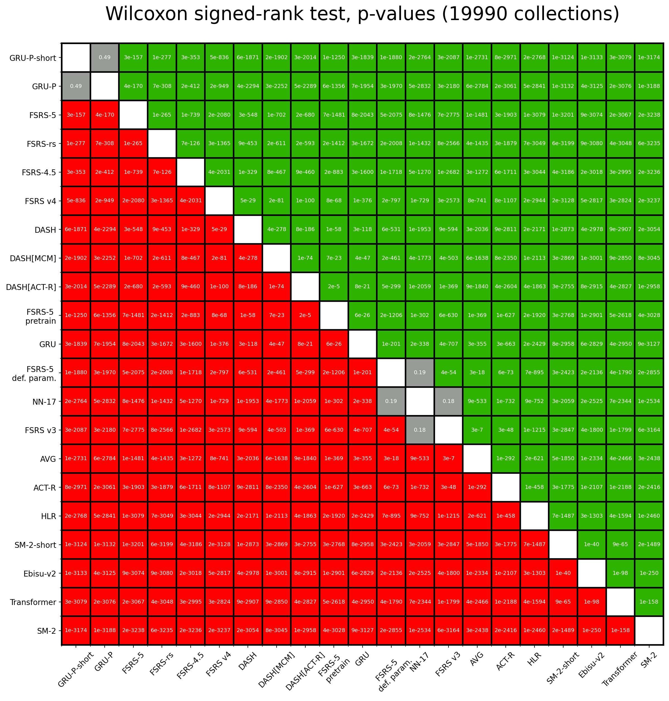

# FSRS Benchmark

## Introduction

Spaced repetition algorithms are computer programs designed to help people schedule reviews of flashcards. A good spaced repetition algorithm helps you remember things more efficiently. Instead of cramming all at once, it spreads out your study sessions over time. To make this efficient, these algorithms try to understand how your memory works. They aim to predict when you're likely to forget something, so they can schedule a review just in time.

This benchmark is a tool to test how well different algorithms do at predicting your memory. It compares several algorithms to see which ones give the most accurate predictions.

## Dataset

The dataset for the FSRS benchmark comes from 20 thousand people who use Anki, a flashcard app. In total, this dataset contains information about ~1.5 billion reviews of flashcards. If you would like to obtain the full dataset, please contact [Damien Elmes](https://github.com/dae), the main Anki developer.

## Evaluation

### Data Split

In the FSRS benchmark, we use a tool called TimeSeriesSplit. This is part of the [sklearn](https://scikit-learn.org/) library used for machine learning. The tool helps us split the data by time—older reviews are used for training and newer reviews for testing. That way, we don't accidentally cheat by giving the algorithm future information it shouldn't have. In practice, we use past study sessions to predict future ones. This makes TimeSeriesSplit a good fit for our benchmark.

Note: TimeSeriesSplit will remove the first split from evaluation. This is because the first split is used for training, and we don't want to evaluate the algorithm on the same data it was trained on.

### Metrics

We use two metrics in the FSRS benchmark to evaluate how well these algorithms work: log loss and a custom RMSE that we call RMSE (bins).

- Log Loss (also known as Binary Cross Entropy): Utilized primarily for its applicability in binary classification problems, log loss serves as a measure of the discrepancies between predicted probabilities of recall and review outcomes (1 or 0). It quantifies how well the algorithm approximates the true recall probabilities, making it an important metric for model evaluation in spaced repetition systems.
- Weighted Root Mean Square Error in Bins (RMSE (bins)): This is a metric engineered for the FSRS benchmark. In this approach, predictions and review outcomes are grouped into bins according to the predicted probabilities of recall. Within each bin, the squared difference between the average predicted probability of recall and the average recall rate is calculated. These values are then weighted according to the sample size in each bin, and then the final weighted root mean square error is calculated. This metric provides a nuanced understanding of model performance across different probability ranges.

Smaller is better. If you are unsure what metric to look at, look at RMSE (bins). That value can be interpreted as "the average difference between the predicted probability of recalling a card and the measured probability". For example, if RMSE (bins)=0.05, it means that that algorithm is, on average, wrong by 5% when predicting the probability of recall.

### Models

- FSRS v3: the first version of the FSRS algorithm that people actually used.
- FSRS v4: the upgraded version of FSRS, made better with help from the community.
- FSRS-4.5: the minorly improved version based on FSRS v4. The shape of the forgetting curve has been changed.
- FSRS rs: the Rust port of FSRS v4, it's simplified due to the limitations of the Rust-based deep learning framework. See also: https://github.com/open-spaced-repetition/fsrs-rs
- LSTM: a type of neural network that's often used for making predictions based on a sequence of data. It's a classic in the field of machine learning for time-related tasks. Our implementation includes 489 parameters.
- HLR: the model proposed by Duolingo. Its full name is Half-Life Regression, for more details, you can read the paper [here](https://github.com/duolingo/halflife-regression).
- SM-2: one of the early algorithms used by SuperMemo, the first spaced repetition software. It was developed more than 30 years ago, and it's still popular today. [Anki's default algorithm is based on SM-2](https://faqs.ankiweb.net/what-spaced-repetition-algorithm.html), [Mnemosyne](https://mnemosyne-proj.org/principles.php) also uses it.

For more details about the FSRS algorithm, read this wiki page: [The Algorithm](https://github.com/open-spaced-repetition/fsrs4anki/wiki/The-Algorithm).

## Result

Total number of users: 19,990.

Total number of reviews for evaluation: 708,151,820.

The following tables represent the weighted means and the 99% confidence intervals. The best result is highlighted in **bold**.

### Weighted by number of reviews

| Algorithm | Log Loss | RMSE (bins) |
| --- | --- | --- |
| **FSRS-4.5** | **0.32±0.006** | **0.043±0.0010** |
| FSRS rs | 0.33±0.006 | 0.046±0.0011 |
| FSRS v4 | 0.33±0.006 | 0.052±0.0014 |
| FSRS v3 | 0.36±0.007 | 0.068±0.0016 |
| LSTM | 0.37±0.007 | 0.075±0.0017 |
| FSRS-4.5 (default parameters) | 0.35±0.006 | 0.076±0.0020 |
| SM-2 | 0.54±0.012 | 0.170±0.0031 |
| HLR | 0.70±0.017 | 0.193±0.0046 |

### Weighted by ln(number of reviews)

| Algorithm | Log Loss | RMSE (bins) |
| --- | --- | --- |
| **FSRS-4.5** | **0.346±0.0030** | **0.063±0.0008** |
| FSRS rs | 0.350±0.0031 | 0.066±0.0008 |
| FSRS v4 | 0.354±0.0033 | 0.074±0.0009 |
| FSRS-4.5 (default parameters) | 0.376±0.0033 | 0.095±0.0011 |
| FSRS v3 | 0.416±0.0043 | 0.104±0.0014 |
| LSTM | 0.50±0.007 | 0.137±0.0018 |
| SM-2 | 0.68±0.011 | 0.210±0.0020 |
| HLR | 2.03±0.045 | 0.391±0.0040 |

The image below shows the p-values obtained by running the Wilcoxon signed-rank test on the RMSE (bins) of all pairs of algorithms. Red means that the row algorithm performs worse than the corresponding column algorithm, and green means that the row algorithm performs better than the corresponding column algorithm. The top row is green because FSRS-4.5 outperforms all other algorithms; the bottom row is red because HLR performs worse than any other algorithm.

All p-values are extremely small, many orders of magnitude smaller than 0.01. Of course, p-values this low beg the question, "Can we even trust these values?". `scipy.stats.wilcoxon` itself uses an approximation for n>50, and our modified implementation uses an approximation to return the log10(p-value) rather than the p-value itself, to avoid the limitations of floating point numbers. So it's an approximation of an approximation. But more importantly, this test is not weighted, meaning that it doesn't take into account the fact that RMSE (bins) depends on the number of reviews.
Overall, these p-values can be trusted on a qualitative (but not quantitative) level, in other words, we can be sure that all of our algorithms perform differently and that no two algorithms perform exactly the same.



## Median Parameters

FSRS-4.5:

```
0.5615, 1.2723, 3.6032, 8.0462,
5.1368, 1.2205, 0.8679, 0.0387,
1.6499, 0.138, 1.0294,
2.1106, 0.0876, 0.3248, 1.4093,
0.219, 2.8403
```

FSRS rs:

```
0.5141, 1.1631, 3.5152, 7.8989,
5.0981, 1.0942, 0.8011, 0.068,
1.6409, 0.1405, 0.9801,
2.1824, 0.0712, 0.3157, 1.3886,
0.2448, 2.8316
```

## Comparisons with SuperMemo 15/16/17

Please go to:
- [fsrs-vs-sm15](https://github.com/open-spaced-repetition/fsrs-vs-sm15)
- [fsrs-vs-sm17](https://github.com/open-spaced-repetition/fsrs-vs-sm17)


## Run the benchmark

### Requirements

Dataset (tiny): https://github.com/open-spaced-repetition/fsrs-benchmark/issues/28#issuecomment-1876196288

Dependencies:

```bash
pip install -r requirements.txt
```

### Commands

FSRS-4.5:

```bash
python script.py
```

FSRS-4.5 with default parameters:

```bash
DRY_RUN=1 python script.py
```

FSRS-rs:

```bash
FSRS_RS=1 FSRS_NO_OUTLIER=1 PYTHONPATH=~/Codes/anki/out/pylib:~/Codes/anki/pylib python script.py
```

> Please change the `PYTHONPATH` variable to the path of your Anki source code.

FSRSv4/FSRSv3/HLR/LSTM/SM2:

```bash
MODEL=FSRSv4 python other.py
```

> Please change the `MODEL` variable to `FSRSv3`, `HLR`, `LSTM`, or `SM2` to run the corresponding model.

Dev model in fsrs-optimizer:

```bash
DEV_MODE=1 python script.py
```

> Please place the fsrs-optimizer repository in the same directory as this repository.